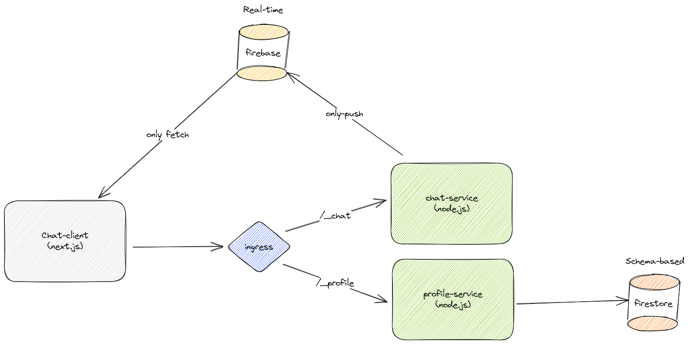

# Chat Application
This is demo project is a simple microservice chat application.
The services are as follows:  

1. `chat-app` Service - Written in `next.js` platform
2. `chat-service` - Written as api-service over the `node.js` platform
3. `profile-service` - Written as api-service over the `node.js` platform

Each of these `api-service`s is connected to a database.  
The `chat-service` - Is connected to `real-time firebase` databse.  
The `profile-service` - Is connected to `firestore`.  

The architecture of the project is like this:
